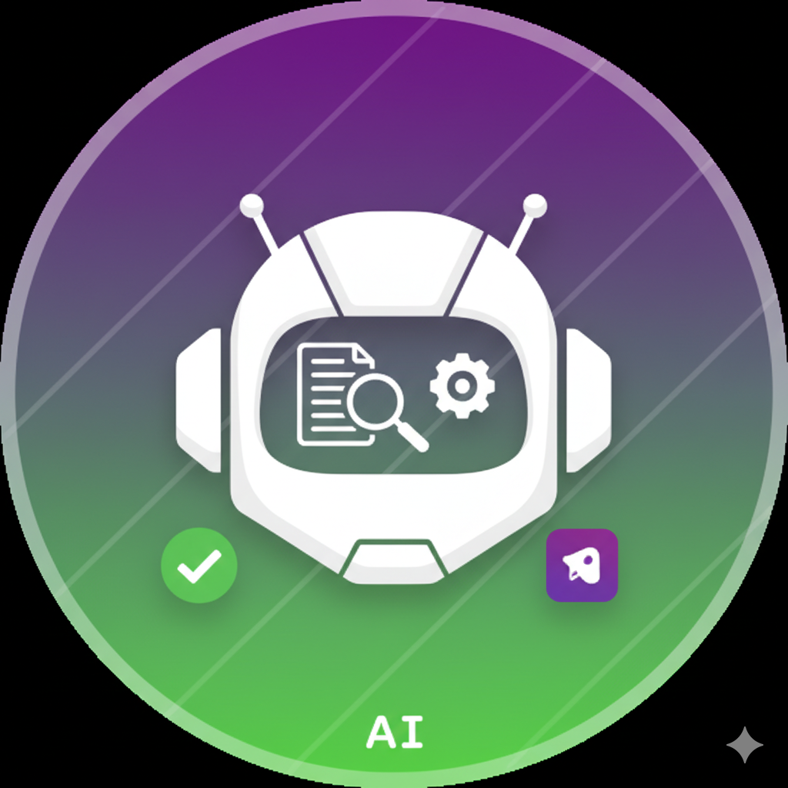
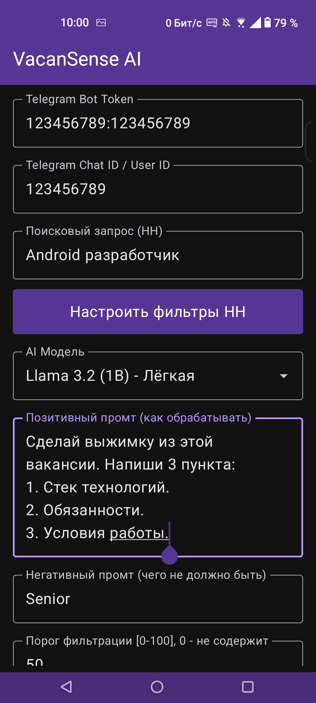
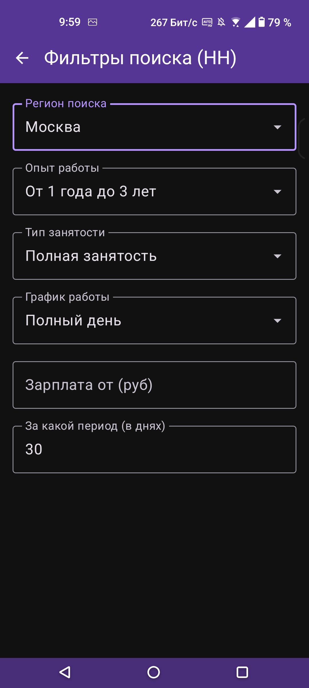
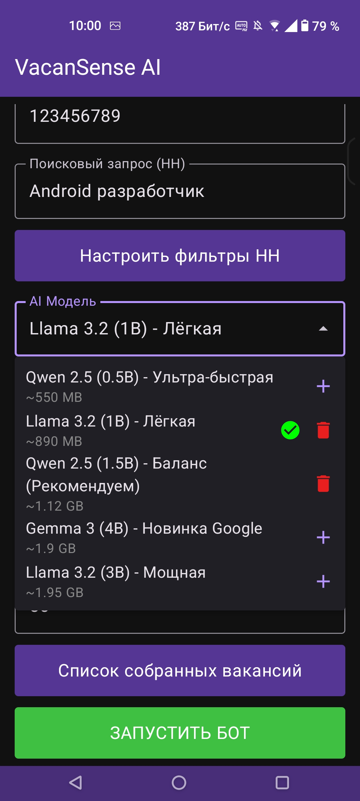
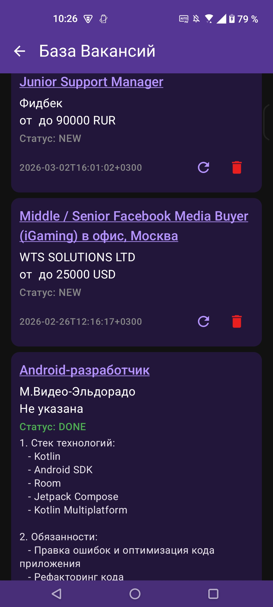

    

# VacanSense AI

    
    
    
    
    

**VacanSense AI** — это умный Android-ассистент для автоматизированного поиска и анализа вакансий. Приложение самостоятельно ищет новые вакансии на HH.ru по заданным фильтрам, пропускает их через **локальную нейросеть (LLM)** прямо на вашем устройстве, делает краткую выжимку и отправляет идеальные совпадения вам в Telegram.

## Ключевые возможности

* **Автоматический мониторинг HH.ru:** Настройте параметры поиска (зарплата, регион, график, опыт работы), и бот будет фоном проверять наличие новых вакансий.
* **On-device AI (Локальная нейросеть):** Вся обработка текста происходит прямо на телефоне с использованием GGUF-моделей (Qwen, Llama, Gemma). Ваши данные **НЕ ОТПРАВЛЯЮТСЯ** на сторонние AI-серверы! Всё локально.
* **Гибкий промптинг:**
  - *Positive Prompt:* Укажите, как именно нейросеть должна сделать выжимку (например, "только стек технологий и обязанности").
  - *Negative Prompt:* Задайте критерии отсева (например, "отсеивать вакансии с легаси-кодом"), и нейросеть сама отбракует нерелевантные варианты по заданной шкале (0-100%).
* **Интеграция с Telegram:** Подключите своего бота, и VacanSense AI будет присылать готовую, отфильтрованную и отформатированную информацию прямо вам в личные сообщения.
* **Фоновая работа:** Работает как Foreground Service, методично собирая и анализируя данные, пока вы занимаетесь своими делами.

## Скриншоты

| Главный экран (Настройки) | Экран фильтров (HH) |
| :---: | :---: |
|  |  |

| Загрузка LLM моделей | База собранных вакансий |
| :---: | :---: |
|  |  |
## Архитектура и стек технологий

Проект разработан с соблюдением принципов **Clean Architecture**. Это обеспечивает высокую тестируемость и легкость масштабирования.

### Стек:
* **Язык:** Kotlin
* **UI:** Jetpack Compose (Material 3)
* **Асинхронность:** Coroutines & Flow
* **Сеть:** Retrofit2 + Gson (HH API & Telegram API)
* **База данных:** Room
* **Локальное хранилище:** DataStore (Preferences)
* **AI Engine:** LlamaCpp (C++ wrapper для Android) для запуска GGUF-моделей.
* **Background Tasks:** Foreground Service + PowerManager WakeLocks + DownloadManager

### Ограничения
Ограничения обусловлены использованием библиотеки **Llama.cpp**, которая была перекомпилирована под меньшую версию **SDK**, чем доступна в изначальном проекте. 

Была попытка перекомпиляции под архитектуру **armeabi-v7a** (32-битная), но разработчики программно запретили. Так как данная архитектура имеет существенное ограничение памяти и позволяет адресовать максимум 4 ГБ ОЗУ. А даже самые маленькие современные LLM (например, Llama-3-8B) после квантования в 4 бита занимают около 4–5 ГБ.

Кроме того в **armeabi-v7a** отсутствуют необходимые инструкции - llama.cpp критически зависит от векторных вычислений (SIMD) для ускорения матричного умножения.

* **minSdk:** 30
* **Android:** 11
* **Архитектура:** arm64-v8a

### Настройка приложения:
1. Создайте Telegram бота через `@BotFather` и скопируйте **Token**.
2. Узнайте свой **Chat ID/User ID** (например, через бота `@userinfobot`).
3. В приложении введите Token и ID.
4. В разделе моделей выберите и скачайте подходящую LLM.
5. Настройте фильтры HH.ru и нажмите **ЗАПУСТИТЬ БОТ**.
